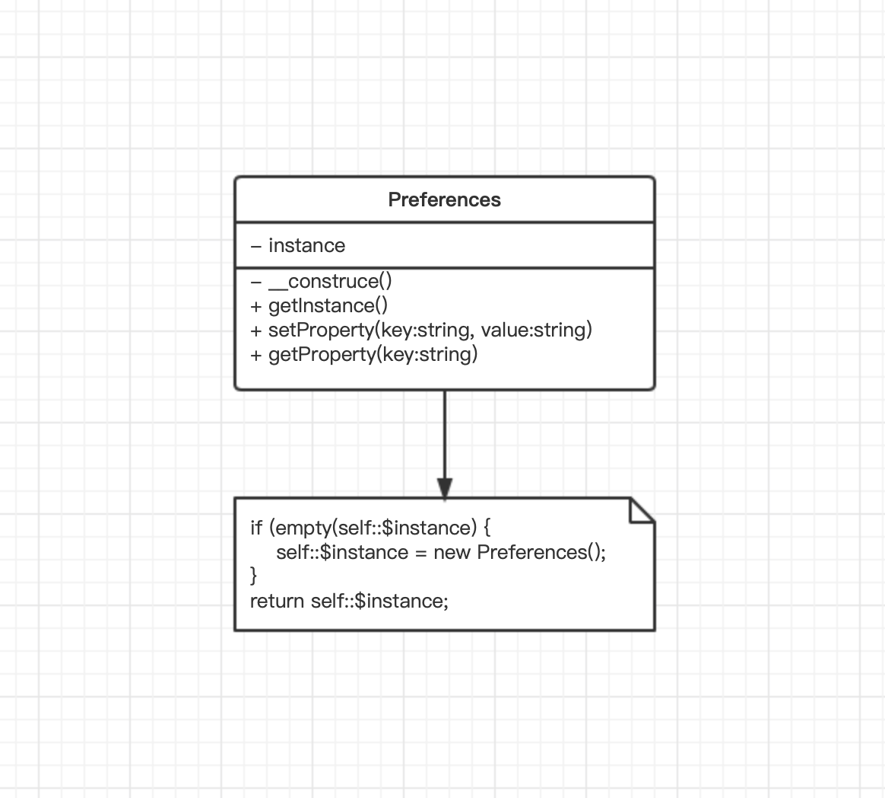
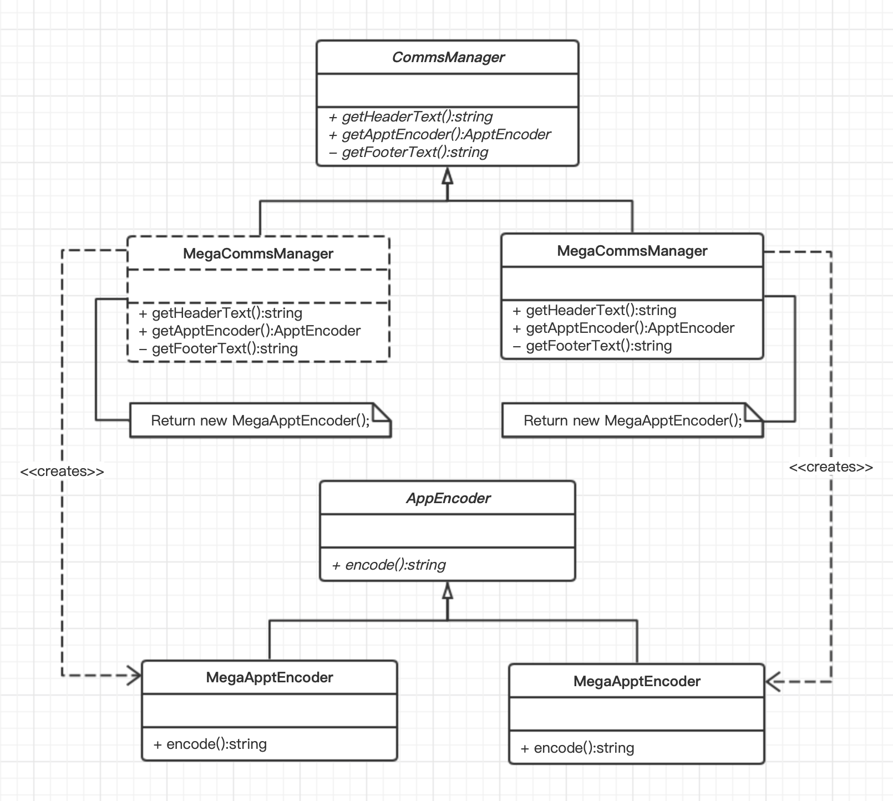
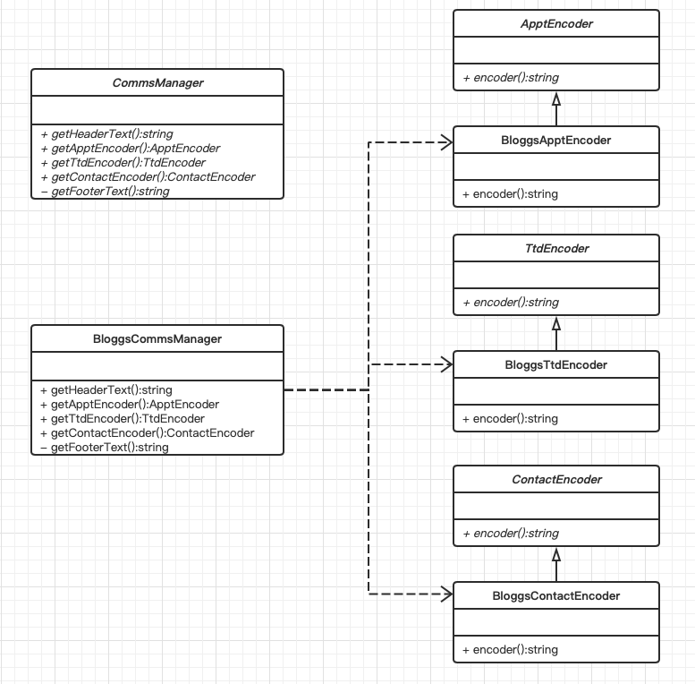

## 设计模式二

## 对象模式分类
### 创建设计模式（Creational Patterns）(5种)：
用于创建对象时的设计模式。更具体一点，初始化对象流程的设计模式。当程序日益复杂时，需要更加灵活地创建对象，同时减少创建时的依赖。而创建设计模式就是解决此问题的一类设计模式。

- 单例模式【Singleton】
- 工厂模式【Factory】
- 抽象工厂模式【AbstractFactory】
- 建造者模式【Builder】
- 原型模式【Prototype】
  
### 结构设计模式（Structural Patterns）(7种)：
用于继承和接口时的设计模式。结构设计模式用于新类的函数方法设计，减少不必要的类定义，减少代码的冗余。

- 适配器模式【Adapter】
- 桥接模式【Bridge】
- 合成模式【Composite】
- 装饰器模式【Decorator】
- 门面模式【Facade】
- 代理模式【Proxy】
- 享元模式【Flyweight】
### 行为模式（Behavioral Patterns）(11种)：
用于方法实现以及对应算法的设计模式，同时也是最复杂的设计模式。行为设计模式不仅仅用于定义类的函数行为，同时也用于不同类之间的协议、通信。

- **策略模式【Strategy】**
- **模板方法模式【TemplateMethod】**
- 观察者模式【Observer】
- 迭代器模式【Iterator】
- 责任链模式【ResponsibilityChain】
- 命令模式【Command】
- 备忘录模式【Memento】
- **状态模式【State】**
- 访问者模式【Visitor】
- 中介者模式【Mediator】
- 解释器模式【Interpreter】
- 生成对象的问题和解决方法

### 单例模式
- 生成一个且只生成一个对象实例的特殊类。
##### 问题
- 该对象应该可以被系统中的任何对象调用。
- 对象不应该被存储在会被覆写的全局变量中。
- 系统中不应该超过一个对象。也就是说，Y对象可设置对象的一个属性，Z对象不需要通过其他对象就可以直接获得该属性的值。
##### 实现

- 为了实现无法从其自身外部来创建实例的类，将定义一个私有的构造方法
- 定义公共的静态方法getInstance
##### 结果
- php的应用主要在于数据库应用, 所以一个应用中会存在大量的数据库操作, 在使用面向对象的方式开发时(废话), 如果使用单例模式, 则可以避免大量的new 操作消耗的资源。
- 如果系统中需要有一个类来全局控制某些配置信息, 那么使用单例模式可以很方便的实现. 这个可以参看zend Framework的FrontController部分。
- 在一次页面请求中, 便于进行调试, 因为所有的代码(例如数据库操作类db)都集中在一个类中, 我们可以在类中设置钩子, 输出日志，从而避免到处var_dump, echo。

### 工厂模式
- 构建创建者类的继承层级。
##### 问题
- 假设有一个关于个人事务管理的项目，其功能之一是管理Appointment(预约)对象，我们的业务团队和另一个公司建立了关系，目前需要用一个叫做BloggsCal的格式来和他们交流预约数据。但是业务团队提醒我们将来可能需要面对更多的数据格式。

##### 实现

- 创建者是一个工厂类，其中定义了用于生产产品对象的类方法。
##### 结果
- 当有新的产品需要加进来时不需要新增改变底层当类，可以直接继承接口，外部实现就可以了；

### 抽象工厂
- 功能相关产品的创建
##### 问题
- 刚刚通过加入更多的编码格式来使此结构"横向"增长，但是如何通过给不同类型的PIM对象加入编码器使它"纵向"
增长呢？
##### 实现

- CommsManager抽象类定义了用于生成3个产品（ApptEncoder、TtdEncoder、ContactEncoder）的接口。
- 我们需要先实现一个具体的创建者，然后才能创建一个特写类型的具体产品。
##### 结果
- 将系统与实现的细节分享开来。我们可以在示例中添加或移出任意数目的编码格式而不会影响系统。
- 对系统中功能和相关的元素强制进行组合
- 添加新产品将会令人苦恼。因为不仅要创建新产品的具体实现，而且为了支持它，我们必须修改抽象创建者和它的每一个具体实现。

### 原型模式